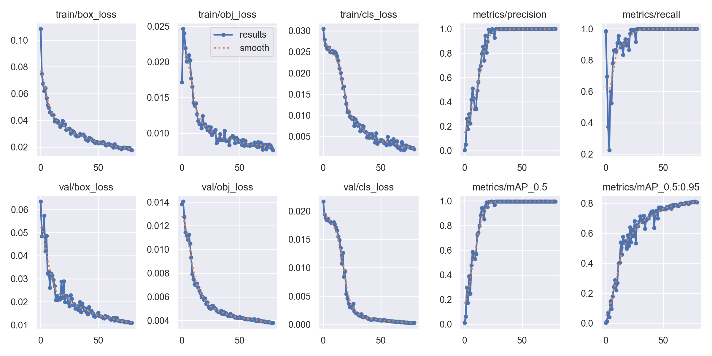
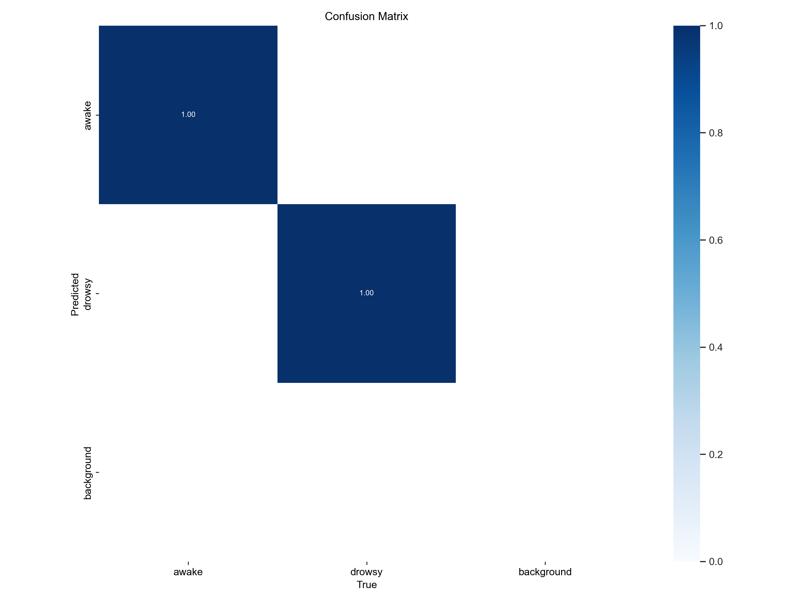
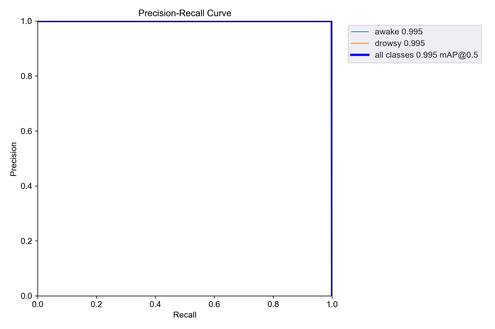
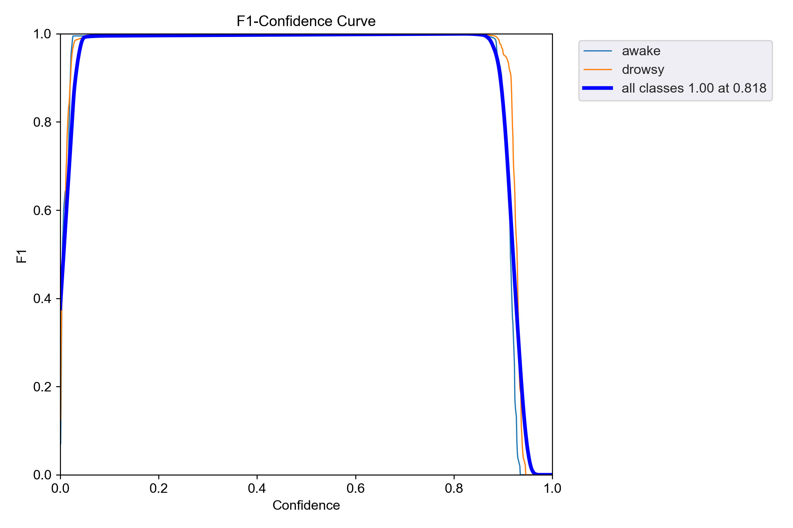
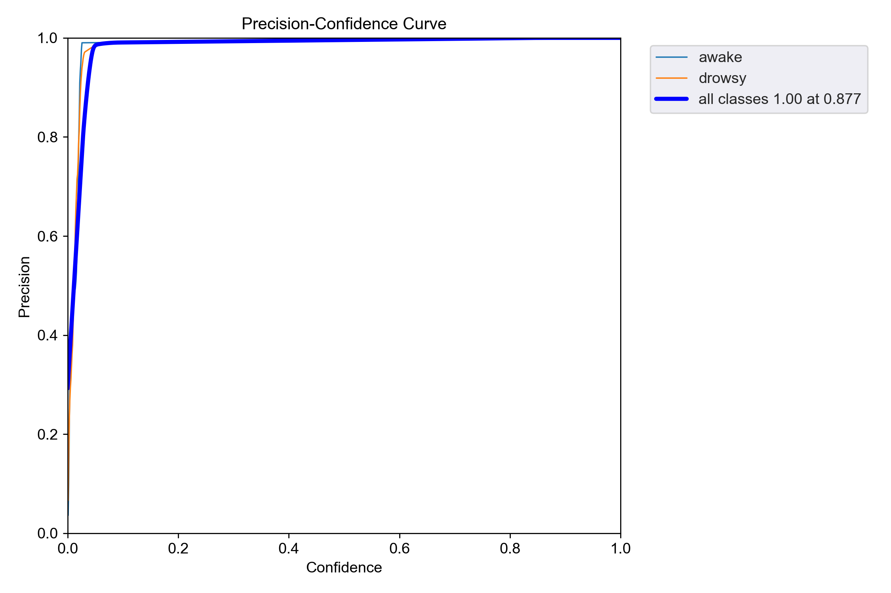
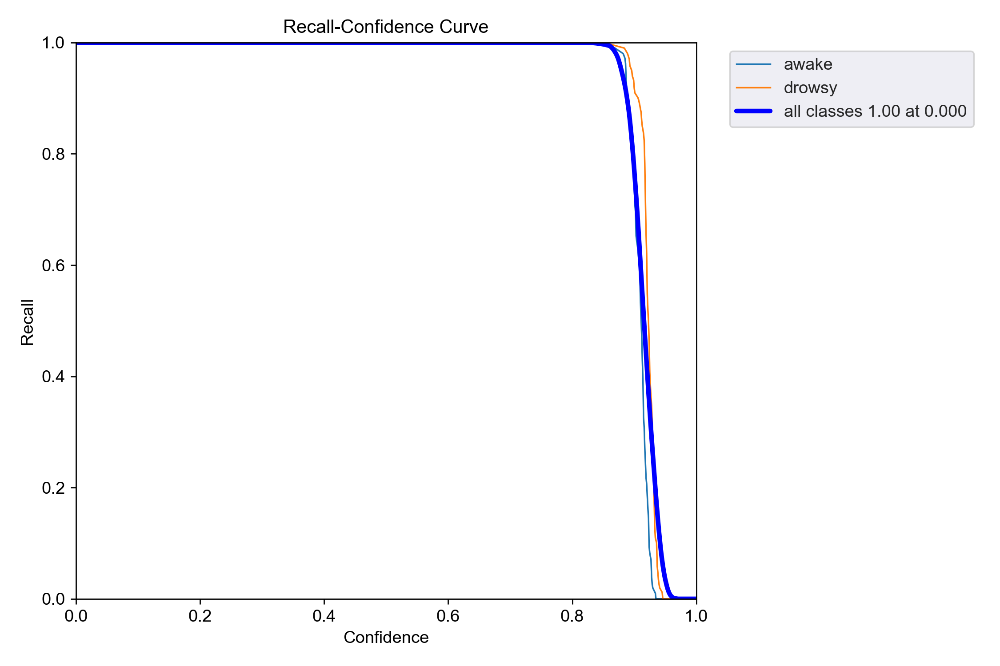
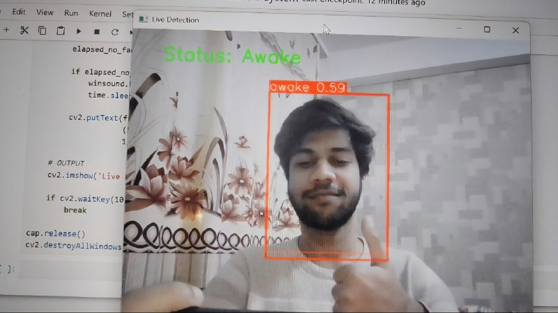

# Real-Time Driver Drowsiness Detection System 🚗

A real-time driver drowsiness detection system built using YOLOv5 and OpenCV.  
The system detects whether a person is awake or drowsy using a custom-trained object detection model and triggers an alert if drowsiness persists.

---

## 🚀 Overview

This project uses a custom dataset collected via webcam and trained using YOLOv5 to classify two states:
- Awake
- Drowsy

The system performs real-time detection and raises an alert if the user remains in a drowsy state for more than 3 seconds.

---

## 🧠 Features

- Real-time detection using webcam
- Custom YOLOv5 model training
- Binary classification: Awake vs Drowsy
- Alert system (continuous beep until awake)
- Handles "no face detected" scenarios
- Lightweight and runs on CPU

---

## 🛠️ Tech Stack

- Python
- YOLOv5 (Ultralytics)
- OpenCV
- PyTorch
- NumPy

---

## 📂 Project Structure
```
Real-Time-Driver-Drowsiness-Detection-System/
│
├── Real-Time-Driver-Drowsiness-Detection-System.ipynb
├── dataset.yaml
├── requirements.txt
└── README.md
```


---

## 📊 Model Training Details

- Model: YOLOv5 (pretrained weights: yolov5s.pt)
- Epochs: 80
- Batch Size: 8
- Classes: 2 (awake, drowsy)
- Dataset: Custom collected (~200+ images)

---

## 📈 Results

### 🔹 Training Results
<p align="center">
  
</p>

### 🔹 Confusion Matrix
<p align="center">
  
</p>

### 📊 Evaluation Curves

<p align="center">
  
  
</p>

<p align="center">
  
  
</p>

---

## 🎥 Demo

<p align="center">
  <a href="https://drive.google.com/file/d/1HLLz2Yp0Gurl_vuln4Id5DNOnstHUpTT/view?usp=drivesdk">
    
  </a>
</p>

<p align="center">
  ▶️ Click the image to watch the demo video
</p>

- Live detection
- Alert triggering after 3 seconds
- Recovery to awake state

---

## ⚙️ How It Works

1. Collect images using webcam
2. Label images using LabelImg
3. Train YOLOv5 model on custom dataset
4. Load trained model using PyTorch Hub
5. Run real-time detection using OpenCV
6. Trigger alert if drowsy state persists

---

## 🔔 Alert Logic

- If "drowsy" is detected continuously for 3 seconds → alarm starts
- Alarm continues until "awake" is detected again

---

## ⚠️ Limitations

- Small dataset → may overfit
- Sensitive to head position and lighting
- May miss detection when face is not clearly visible

---

## 🔮 Future Improvements

- Increase dataset size and diversity
- Add eye aspect ratio (EAR) for better accuracy
- Deploy as mobile or embedded system
- Integrate with vehicle systems

---

## ▶️ How to Run

1. Clone the repository:
```
git clone https://github.com/faizanlkhan/Real-Time-Driver-Drowsiness-Detection-System.git
```
2. Install dependencies:
```
pip install -r requirements.txt
```
3. Run the notebook:
```
jupyter notebook
```
4. Execute cells for:
- Data collection
- Training
- Real-time detection

---

## 📌 Notes

- YOLOv5 folder and training runs are excluded to keep repo lightweight
- Model weights are not included (can be retrained using provided dataset config)

---

## 👨‍💻 Author

Faizan Laique Khan
